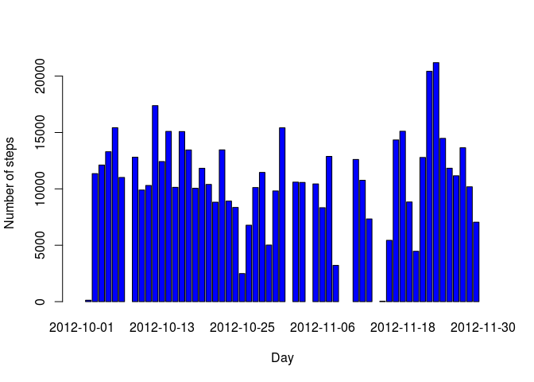
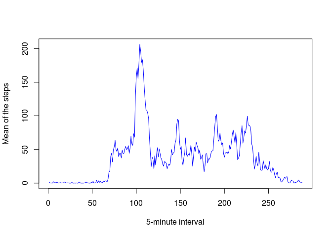
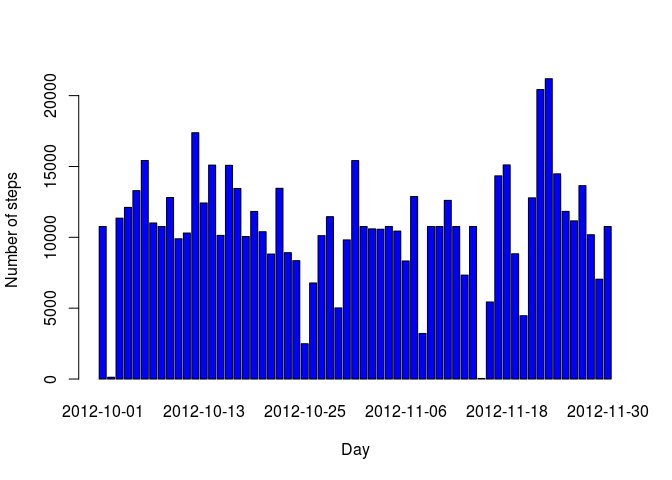
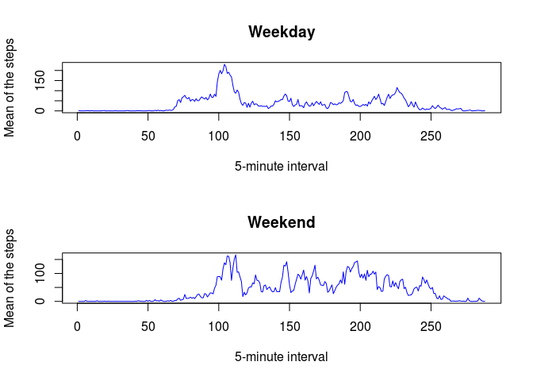

# Reproducible Research: Peer Assessment 1


## Loading and preprocessing the data

Show any code that is needed to  
1. Load the data (i.e. read.csv()):


```r
dataset<-read.csv("activity.csv",header=TRUE,sep=",")
```

2. Process/transform the data (if necessary) into a format suitable for your analysis:

```r
dataset$num_interval<-rep(seq(288),61)
```
I add a column that will be useful later: I replicate the numbers from 1 to 288 (in a day there are 288 5-minute intervals) for 61 times (61 days in the analisys).   
Anyway the data is tidy:  
1. Each variable forms a column  
2. Each observation forms a row  
3. Each table stores data about one kind of observation  


## What is mean total number of steps taken per day?
For this part of the assignment, you can ignore the missing values in the dataset.  
1. Make a histogram of the total number of steps taken each day 

```r
tot_steps_day<-tapply(dataset$steps,dataset$date,sum)
barplot(tot_steps_day,xlab="Day",ylab="Number of steps",col='blue')
```

 
  
2. Calculate and report the mean and median total number of steps taken per day

```r
mean(tot_steps_day,na.rm=TRUE)
```

```
## [1] 10766.19
```

```r
median(tot_steps_day,na.rm=TRUE)
```

```
## [1] 10765
```

## What is the average daily activity pattern?
1. Make a time series plot (i.e. type = "l") of the 5-minute interval (x-axis) and the average number of steps taken, averaged across all days (y-axis)  
To represent this type of  plot I am forced to usa a dataset without NA values.

```r
dataset_no_NA<-dataset[complete.cases(dataset),]
mean_interval<-tapply(dataset_no_NA$steps,dataset_no_NA$interval,mean)
plot(mean_interval,type="l",xlab="5-minute interval", ylab="Mean of the steps",col='blue')
```

 

2. Which 5-minute interval, on average across all the days in the dataset, contains the maximum number of steps?  
The max value is:

```r
max(mean_interval)
```

```
## [1] 206.1698
```
And these are respectively:  
-The 5-minute interval  
-The index in the 'mean_interval' vector

```r
which.max(mean_interval)
```

```
## 835 
## 104
```
## Imputing missing values
Note that there are a number of days/intervals where there are missing values (coded as NA). The presence of missing days may introduce bias into some calculations or summaries of the data.

1. Calculate and report the total number of missing values in the dataset (i.e. the total number of rows with NAs)  
The number of FALSE is the number of NAs

```r
table(complete.cases(dataset))
```

```
## 
## FALSE  TRUE 
##  2304 15264
```

2. Devise a strategy for filling in all of the missing values in the dataset. The strategy does not need to be sophisticated. For example, you could use the mean/median for that day, or the mean for that 5-minute interval, etc.  
3. Create a new dataset that is equal to the original dataset but with the missing data filled in.  
I decided to do step 2 and step 3 together.  
I use the 5-minute interval strategy because there are entire NA days.

```r
filled_dataset<-dataset

for(i in 1:nrow(dataset)){
        if(is.na(dataset[i,1])){
                num_interval<-dataset[i,4]
                filled_dataset[i,1]<-mean_interval[num_interval]
        }
}
```

4. Make a histogram of the total number of steps taken each day and Calculate and report the mean and median total number of steps taken per day. Do these values differ from the estimates from the first part of the assignment? What is the impact of imputing missing data on the estimates of the total daily number of steps?

```r
filled_tot_steps_day<-tapply(filled_dataset$steps,filled_dataset$date,sum)
barplot(filled_tot_steps_day,xlab="Day",ylab="Number of steps",col='blue')
```

 

```r
mean(filled_tot_steps_day)
```

```
## [1] 10766.19
```

```r
median(filled_tot_steps_day)
```

```
## [1] 10766.19
```
Only the median is different from the previous computation. In particular in this case mean and median are equal.


## Are there differences in activity patterns between weekdays and weekends?
For this part the weekdays() function may be of some help here. Use the dataset 
with the filled-in missing values for this part.    

I need this for weekdays in english

```r
Sys.setlocale("LC_TIME", "en_US.UTF-8")
```

```
## [1] "en_US.UTF-8"
```

1. Create a new factor variable in the dataset with two levels – “weekday” and 
 “weekend” indicating whether a given date is a weekday or weekend day.

```r
day_ofthe_week<-weekdays(as.Date(filled_dataset$date))

for(i in 1:length(day_ofthe_week)){
        if(day_ofthe_week[i]=="Saturday" | day_ofthe_week[i]=="Sunday") day_ofthe_week[i]<-"weekend"
        else day_ofthe_week[i]<-"weekday"
}

filled_dataset$day_ofthe_week<-day_ofthe_week
head(filled_dataset)
```

```
##       steps       date interval num_interval day_ofthe_week
## 1 1.7169811 2012-10-01        0            1        weekday
## 2 0.3396226 2012-10-01        5            2        weekday
## 3 0.1320755 2012-10-01       10            3        weekday
## 4 0.1509434 2012-10-01       15            4        weekday
## 5 0.0754717 2012-10-01       20            5        weekday
## 6 2.0943396 2012-10-01       25            6        weekday
```
 2. Make a panel plot containing a time series plot (i.e. type = "l") of the
  5-minute interval (x-axis) and the average number of steps taken, averaged 
  across all weekday days or weekend days (y-axis). See the README file in 
  the GitHub repository to see an example of what this plot should look like 
  using simulated data.

```r
week<-with(filled_dataset,tapply(steps,list(interval,day_ofthe_week),mean))
# Week is a matrix
# I need to convert it in a data.frame
df_week<-data.frame(week)

par(mfrow=c(2,1))
with(df_week,{
        plot(weekday,xlab="5-minute interval", ylab="Mean of the steps",main="Weekday",type="l",col='blue')
        plot(weekend,xlab="5-minute interval", ylab="Mean of the steps",main="Weekend",type="l",col='blue')
})
```

 


